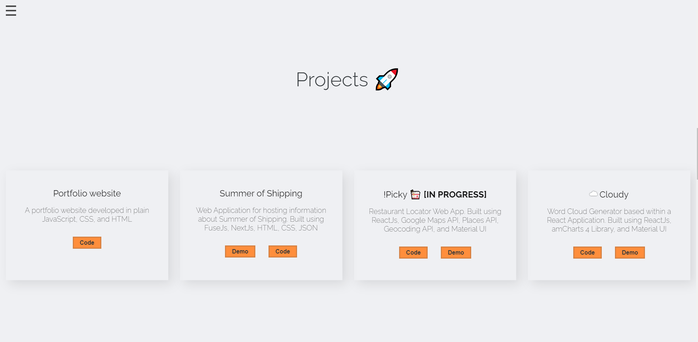

# [Portfolio Website // Now Deprecated](https://hi-van.github.io)


Table of Contents
=================

   * [Description](#description)
   * [Pages](#pages)
      * [Home](#about-me)
      * [Side Nav](#side-nav)
      * [Experience](#experience)
      * [Projects](#projects)
      * [About Me](#skills)
      * [Contact Info](#contact-info)


# Description

This website is built using HTML and CSS. It is made with the intention of being a way to host my personal projects and some information about myself.

# Pages:

### Home


This is the landing div on my website. 

Orange
```
  font-family: "Vibur", cursive;
  font-style: italic;
  text-shadow: 0 0 1vw #1041ff, 0 0 3vw #1041ff, 0 0 10vw #1041ff,
    0 0 10vw #1041ff, 0 0 0.4vw #8bfdfe;
  color: #28d7fe;
```

Blue
```
  font-family: "Vibur", cursive;
  font-style: italic;
  text-shadow: 0 0 1vw #fa1c16, 0 0 3vw #fa1c16, 0 0 10vw #fa1c16,
    0 0 10vw #fa1c16, 0 0 0.4vw #fed128;
  color: #fed128;
```


The component can be imported and used as:
```
import AboutMe from './components/about-me';

function App() {
  return (
    <div className="App">
      <AboutMe />
    </div>
  );
}

export default App;
```

### Side Nav


This component page is a list of my past relevant experiences. Each experience is separated into its own div:

```
  <div className="exp-div">
    <div className="exp-title">Univeristy of Connecticut // CS & Mathematics Tutor </div>
    <div className="exp-desc">Feb 2020 - May 2020 // Stamford, CT</div>
    <div className="exp-desc">- Explained technical concepts and issues to students, clarifying confusion set upon student knowledge</div>
    <div className="exp-desc">- Communicated Computer Science & Calculus curriculum to students, creating study plans and identifying missing knowledge for students</div>
  </div>
```

The component can be imported and used as:
```
import Experience from './components/experience';

function App() {
  return (
    <div className="App">
      <Experience />
    </div>
  );
}

export default App;
```

### Experience


This component page is the first component in the website. It integrates the Navigation and Socials components within it. Below is the entire code for the Home component:

```
import React from 'react';
import './componentCSS/home.css';
import Navigation from './navigation';
import Socials from './socials';

function Home() {
    return (
        <div id="home">
            <Socials />
            <div className="neon-sign">
                <div className="title">Vanouphon Sirisouk</div>
                <div className="subtitle">software developer</div>
            </div>
            <Navigation />
        </div>
    );
}

export default Home;
```

The component can be imported and used as:
```
import Home from './components/home';

function App() {
  return (
    <div className="App">
      <Home />
    </div>
  );
}

export default App;
```

### Projects


This component is a row of links to different components of my website. It uses flex and flex-wrap in order to build a more responsive styling:
```
  .nav-wrapper {
  display: flex;
  flex-wrap: wrap;
  justify-content: center;
  margin-top: 4rem;
  margin-bottom: 8rem;
}
```

The component can be imported and used as:
```
import Navigation from './navigation';

function Home() {
    return (
        <div id="home">
            <div className="neon-sign">
                // more html
            </div>
            <Navigation />
        </div>
    );
}

export default Home;
```
### About Me


This component is a row of links, the same as the navigation component, but uses a different text color and positioning. It also uses flex and wlex-wrap to promote a more responsive styling:

```
.social-wrapper {
    display: flex;
    flex-wrap: wrap;
}
```

This component can be import and used as:
```
import Socials from './socials';

function Home() {
    return (
        <div id="home">
            <Socials />
            <div className="neon-sign">
              // more html
            </div>
        </div>
    );
}

export default Home;
```

### Contact Info



This component page displays the projects I have worked on so far. It integrates ```<HoverVideoPlayer videoSrc="Video Source Here">``` from the ```react-hover-video-player``` dependency, so it needs to be imported as ```import HoverVideoPlayer from 'react-hover-video-player';``` for it pause videos on hover. Each project is contained within an individual div, that uses grid and autofit in order to promote responsive styling:

```
              <-HTML CODE->
              
              <div className="proj-div">
                <HoverVideoPlayer className="proj-display" videoSrc={newPortfolio} autoplay="true" />
                <div className="proj-text">
                    <div className="exp-title">Portfolio Website V4</div>
                    <div className="exp-desc">The newest iteration of my portfolio website, hosted by Github Pages. Built using CSS, ReactJS</div>
                    <div>
                        <a
                            href="https://github.com/Hi-Van/portfolio"
                            target="_blank" rel="noopener noreferrer"><button className="btn-alt">code</button></a>
                    </div>
                </div>
            </div>
            
            <- CSS ->
            
            * The auto fit line means that the grid will create a new row when the grid items can no longer fit with a width of 300px to 1fr
            .proj-div {
              display: grid;
              grid-template-columns: repeat( auto-fit, minmax(300px, 1fr) );
              margin-bottom: 16rem;
            }
```

The component can be imported and used as:
```
import Projects from './components/projects';


function App() {
  return (
    <div className="App">
      <Projects />
    </div>
  );
}

export default App;
```
