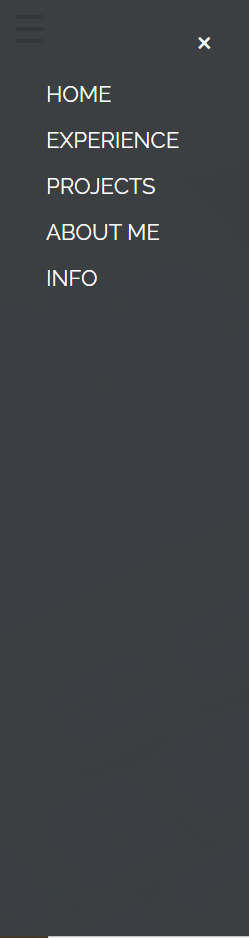
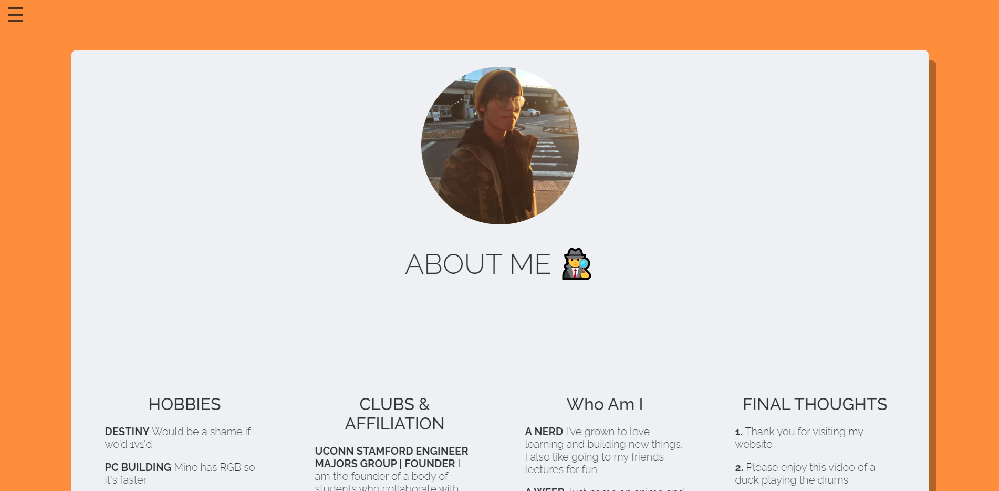
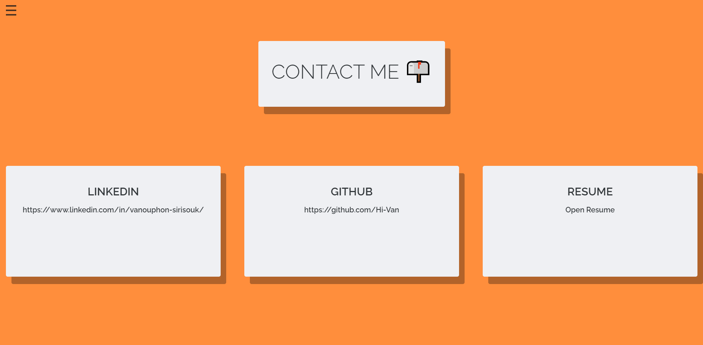

# [Portfolio Website // Now Deprecated](https://hi-van.github.io)


Table of Contents
=================

   * [Description](#description)
   * [Pages](#pages)
      * [Home](#about-me)
      * [Side Nav](#side-nav)
      * [Experience](#experience)
      * [Projects](#projects)
      * [About Me](#skills)
      * [Contact Info](#contact-info)


# Description

This website is built using HTML and CSS. It is made with the intention of being a way to host my personal projects and some information about myself.

# Pages:

### Home


This is the landing div on my website. It has a video div, color layer div, and content div. The HTML code for the home page can be found in the snippet below:

```
        <header class="v-header container" id="Home">
        
            <div class="video-fullscreen-wrap">
                <video autoplay muted loop id="backgroundVideo">
                    <source src="backgroundVideo.mp4" autoplay loop muted type="video/mp4">
                </video>
            </div>
            
            <div class="header-overlay"></div>
            
            <div class="header-content">
                <h1>VANOUPHON SIRISOUK</h1>
                <p>SOFTWARE DEVELOPER</p>
                <a href="#Experience"><button>MORE</button></a>
            </div>
        </header>
```

### Side Nav



The side navigation uses two simple JavaScript functions ```openSideMenu()``` and ```closeSideMenu()```. The component consists of two different divs, the ```hamburger-menu``` div and the ```side-nav``` div. When the link in the ```hamburger-menu``` div is clicked, the ```onclick``` will trigger the ```opensideMenu()``` function to display the ```side-nav``` div. When the ```side-nav``` div is open, there is a link when clicked, will trigger an ```onClick``` and cuase the ```closeSideMenu()``` function to run:

```
        // HTML Code
        
        <nav class="navbar">
            <span class="open-slide">
                <a onclick="openSideMenu()">
                    
                </a>
            </span>
        </nav>

        <div id="side-menu" class="side-nav">
            <a class="btn-close" onclick="closeSideMenu()">&times;</a>
            <a href="#Home">HOME</a>
            <a href="#Experience">EXPERIENCE</a>
            <a href="#Projects">PROJECTS</a>
            <a href="#About">ABOUT ME</a>
            <a href="#Info">INFO</a>
        </div>
        
        
        // JavaScript Code
        
        function openSideMenu() {
          document.getElementById('side-menu').style.zIndex = '3';
          document.getElementById('side-menu').style.width = '250px';
          document.getElementById('side-menu').style.opacity = '0.95';
        }
        
        function closeSideMenu() {
          document.getElementById('side-menu').style.zIndex = '-1';
          document.getElementById('side-menu').style.width = '0px';
          document.getElementById('side-menu').style.opacity = '0';
        }        
```

### Experience


This component page is the first component in the website. It integrates the Navigation and Socials components within it. Below is the entire code for the Home component:

```
import React from 'react';
import './componentCSS/home.css';
import Navigation from './navigation';
import Socials from './socials';

function Home() {
    return (
        <div id="home">
            <Socials />
            <div className="neon-sign">
                <div className="title">Vanouphon Sirisouk</div>
                <div className="subtitle">software developer</div>
            </div>
            <Navigation />
        </div>
    );
}

export default Home;
```

The component can be imported and used as:
```
import Home from './components/home';

function App() {
  return (
    <div className="App">
      <Home />
    </div>
  );
}

export default App;
```

### Projects


This component is a row of links to different components of my website. It uses flex and flex-wrap in order to build a more responsive styling:
```
  .nav-wrapper {
  display: flex;
  flex-wrap: wrap;
  justify-content: center;
  margin-top: 4rem;
  margin-bottom: 8rem;
}
```

The component can be imported and used as:
```
import Navigation from './navigation';

function Home() {
    return (
        <div id="home">
            <div className="neon-sign">
                // more html
            </div>
            <Navigation />
        </div>
    );
}

export default Home;
```
### About Me



This component is a row of links, the same as the navigation component, but uses a different text color and positioning. It also uses flex and wlex-wrap to promote a more responsive styling:

```
.social-wrapper {
    display: flex;
    flex-wrap: wrap;
}
```

This component can be import and used as:
```
import Socials from './socials';

function Home() {
    return (
        <div id="home">
            <Socials />
            <div className="neon-sign">
              // more html
            </div>
        </div>
    );
}

export default Home;
```

### Contact Info



This component page displays the projects I have worked on so far. It integrates ```<HoverVideoPlayer videoSrc="Video Source Here">``` from the ```react-hover-video-player``` dependency, so it needs to be imported as ```import HoverVideoPlayer from 'react-hover-video-player';``` for it pause videos on hover. Each project is contained within an individual div, that uses grid and autofit in order to promote responsive styling:

```
              <-HTML CODE->
              
              <div className="proj-div">
                <HoverVideoPlayer className="proj-display" videoSrc={newPortfolio} autoplay="true" />
                <div className="proj-text">
                    <div className="exp-title">Portfolio Website V4</div>
                    <div className="exp-desc">The newest iteration of my portfolio website, hosted by Github Pages. Built using CSS, ReactJS</div>
                    <div>
                        <a
                            href="https://github.com/Hi-Van/portfolio"
                            target="_blank" rel="noopener noreferrer"><button className="btn-alt">code</button></a>
                    </div>
                </div>
            </div>
            
            <- CSS ->
            
            * The auto fit line means that the grid will create a new row when the grid items can no longer fit with a width of 300px to 1fr
            .proj-div {
              display: grid;
              grid-template-columns: repeat( auto-fit, minmax(300px, 1fr) );
              margin-bottom: 16rem;
            }
```

The component can be imported and used as:
```
import Projects from './components/projects';


function App() {
  return (
    <div className="App">
      <Projects />
    </div>
  );
}

export default App;
```
